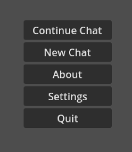
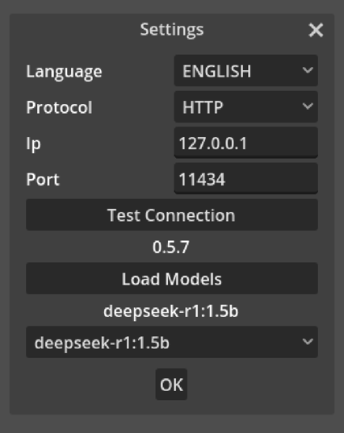
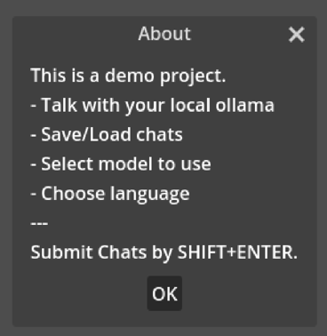
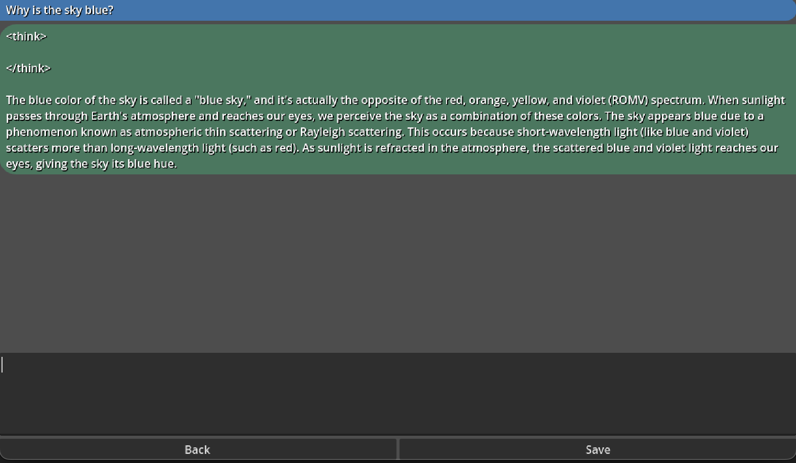

# Local Ollama Chatbot

This is a short Godot exploration project, inspired by [a youtube tutorial](https://www.youtube.com/watch?v=fd1XGAJDB7E).

Requirements are a running [ollama](https://ollama.com/) instance or an API providing the same schema.

## App Overview
### Main Menu

### Settings

### About

### Chat

### Save Chat by name

### Load Chat by name
